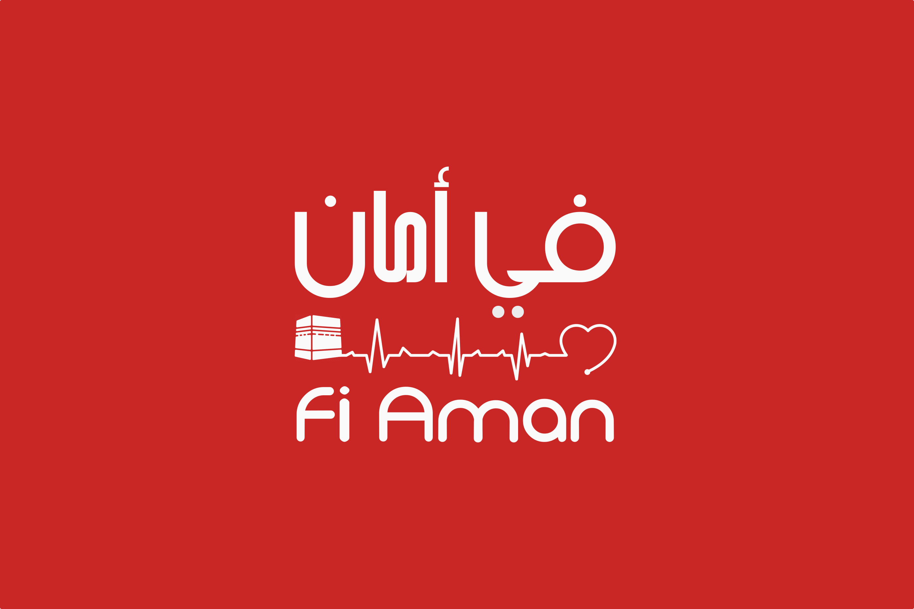

# Fi Aman ' فـي أمـــان '
## Realtime accidents reporting and analytics system

## Inspiration
Time is edge between life and death, and each accident in hajj leads to fatal results, every accident needs immediate intervention which mainly is the problem here due to unavailability of site-rescue force, exact evaluation of the case, lack of intervention material according to each case, the unknown of medical attention spots especially in the crowded areas and also the long turn around time of ambulance response.

## Category
Public health & Communications solutions. 

## What it does
 we have decided to break time to create a system that sees and simulate every action in millions of people and report it in Real-time with advanced dashboard that analysis using data science to set and provide recommendation to the authorities and send Aman "أمـــان" drone to the accident location in order to guide the authorities on the ground to the exact location of the accident, help them detect the exact problem using the camera that exists on the drone, notifying other people of this accident in order to avoid pushing, falling and being trampled.

## How we built it
The system is mainly composed of three parts. Mobile application for el hajjij to report accidents in real time and provides guidance to the nearest location of food, transportation, medical assistance. The second part is the web platform for the authorities to receive reports, informations about hajjij locations and provide analytics and statistics using visualization and Data science and accidents prediction, services optimization and recommendation using ML.. The third part is the Aman "أمـــان" drone which is used as a way to alert and locate the accident as soon as possible. In case of any accident, el hajj report to authorities in real time using the mobile application and Aman "أمـــان" drone  will be sent to that location in order for them to make an intervention as soon as possible.

## Challenges we ran into
Internet connexion, Hajjij data availability , Location accuracy.

## Accomplishments that we're proud of
Providing a high tech solution in order to decrease death rate in el Hajj, Guinness world record breaker and being at the biggest Hackathon in the middle east and north Africa.

## What we learned
Team work,Drone remote controlling and going from an idea to a
complete project both in technical and besiness part.

## What's next for Fi Aman
Being the official Hajj security system adopted by the KSA authorities, providing  a powerful and accurate API service for any company to exploit in their products and provide more services with Aman "أمـــان" drone like medical and food transportation etc
## Used libraries and API
- [Bootstrap](https://github.com/twbs/bootstrap)
- [OpenStreetMap](https://github.com/osmdroid/osmdroid)
- [Leaflet.js](https://leafletjs.com)
- [JQuery](https://github.com/jquery/jquery)
- [DroneKit](https://github.com/dronekit/dronekit-python)

